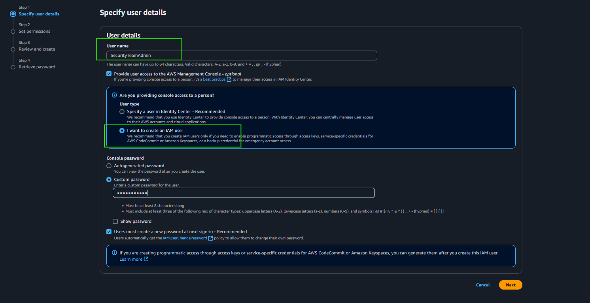

# AWS Security: Idenity and Access Managment

### Overview: 

---

### Completed Tasks

- Set up and overview of the project
- Create an IAM user from the console
- Create IAM users from the CLI
- Create IAM groups and add users to the groups
- Implementing IAM policies
- Create and upload to an S3 bucket
- Create an IAM role for an AWS service
- Use IAM roles to grant AWS cross-account access
- Use IAM roles to grant AWS cross-account access with external ID
- Revoke an IAM role
- Setting permissions boundary
- Test and debug IAM policies using the IAM policy simulator

---

## Project Flow

### 1. Created an IAM user from the console with admin privileges:

### 2. Assigned admin permissions to the IAM user account:

### 3. Configured the AWS CLI on local host CMD & Created sample users from the CLI:

### 4. Created IAM group  and added users :

~ Granted read/write access to an S3 bucket: 

*Note: Users in an IAM group inherit the group's permissions by default.*

### 5. Implemented IAM policies(Customer Managed Policy)

~  **Scope**: All AWS resources x **Actions**: Reader rights for IAM components **Group**: CloudSecurityTeam

### 6. Created and uploaded to an S3 bucket 

~ Note: S3 stores data as objects within buckets. An *object* is a file and any metadata that describes the file. A *bucket* is a container for objects.

### 7. Created an IAM role for an AWS service [EC2 → S3 ]

### 8. Used IAM roles to grant AWS cross-account access 

I created an IAM role for the Audit team with read-only permissions. I confirmed read-only access by attempting to upload to the S3 bucket and creating an EC2 instance. 

### 9. Used IAM roles to grant AWS cross-account access with external ID

~ **Note:** Use the SET command to set the security credentials (access key, secret key, and session token) for WIN users and EXPORT for Mac users.

### 10. Revoked an IAM role 

~ Enforced revoke action on active sessions. 

~ Ouput from external Audit acct 

### 11. Set permissions boundary 

~ Assigned policy for an IAM user account to prevent the user from modifying permissions. 

~ Output from IAM user acct with permission boundary policy assigned

### 12. Tested and debugged IAM policies using the IAM policy simulator

